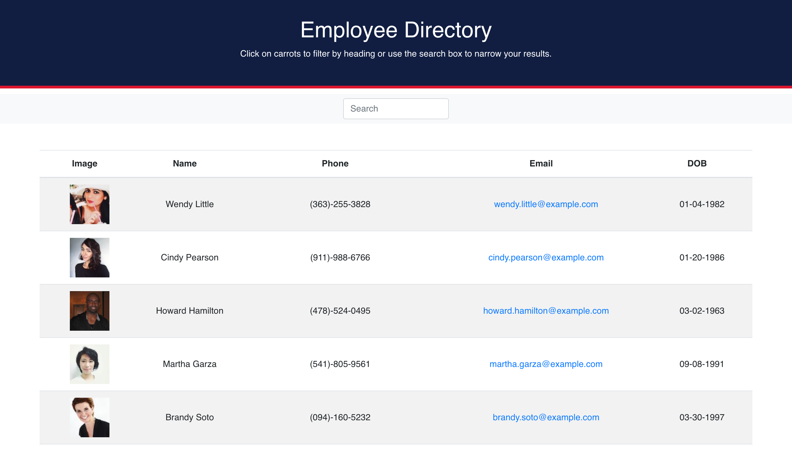

# Employee Tracker

### Description
Simple registry to keep track of employees

## Table of contents
* [Description](#Description)
* [Version](#Version)
* [Features](#Features)
* [Installation](#Installation)
* [Usage](#Usage)
* [Technologies](#Technologies)
* [License](#License)

### Version 
1.0.0

### Features
Diverse range of functions to track all employees. Such as adding, removing, updating,

## Installation
git fork and/or clone the repo. Initialize with 

    yarn add boostrap-react bootstrap axios ---> yarn start

### Technologies
axios, bootstrap, randomuser.me API

## Questions
Follow me on GitHub:  

## License
MIT © Ted Peters